# VisLies 2018 Gallery

October 23, 2018

What a great year for VisLies! We had a small room, but we packed it. And
you guys brought some great examples for us.

<a href="https://drive.google.com/file/d/1duITky6CJKOYgChhlsjJRzUbCdv6VnJZ/view?usp=sharing" class="image-full">
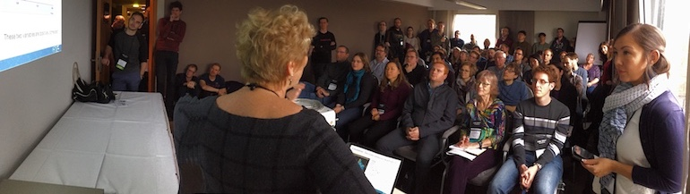
</a>

Let's take a look at all the great lies everyone told.

## Recalibrate Your Banan-o-meter

<a class="image-right" href="https://drive.google.com/open?id=159eTtIIrBNZ7O7kKO9xaynIYN63diOrq">
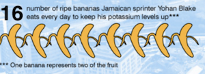
</a>

[Ken Moreland] started us off with a level of silliness measured in
bananas. This infographic tells us a bit of trivia about the number of
bananas consumed daily by sprinter Yohan Blake. But a closer look reveals
that the number and the image don't quite add up.

The graphic shows 8 bananas, but Yohan eats an even more impressive 16.
What gives? Well, if you look closely, you will see a note that "One
banana represents two of the fruit."

Why does 1 banana equal 2? You need to recalibrate your banan-o-meter. If
you want to impress people with your bananas, just show them your bananas.

## A Lonely Bar

<a href="https://drive.google.com/open?id=1Eb1eJiOvNrsAc5xgyDOOE8v6ftftCieC" class="image-right">
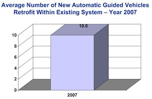
</a>

[Ken][Ken Moreland] next showed this use, or rather misuse, of a bar chart.
This appears to be an attempt to make the presentation of a single dull
number more interesting and failing in multiple ways.

To start with, someone has clearly turned on the 3D bar chart capabilities
in Excel, which is something that we generally discourage. But the problem
with 3D representations is that they make it more difficult to understand
the relative position of things in space. For example, the top of this bar
is aligned with both the 8 and 10 ticks.

But the really weird part of this display is that it is a lone bar. The
point of a bar chart is to visually compare the relative value of two or
more values. But this number is not compared to anything. It looks big, but
any number would look big when you scale the bar to fit the space.
Retrofitting 10 cars might actually be low if that is all you did all year.

## Helpings of Pie

<a href="https://drive.google.com/open?id=1MgCsBS-aWQTabwaTcx1f_LJEYvz6dAy7" class="image-right">
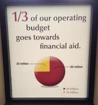
</a>

It is no secret that [Ken][Ken Moreland] is not a fan of pie charts, and
so he often provides examples of their use and abuse. First up is this
public display where the pie chart is essentially correct, but the designer
apparently does not know what one quarter looks like.

<div class="image-stop" />

<a href="https://drive.google.com/open?id=1f1GJJ4tPaCKEQGzJT-LD2PdPTxPSJtHh" class="image-right">
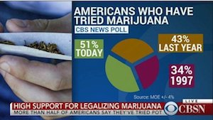
</a>

Unlike [Ken][Ken Moreland], news organizations tend to like pie charts very
much, and apparently they like abusing them as well. Here is a bizarre
example of a pie chart that contains more than 100% of content. It's a
paradox how the pie chart contains more pie than the pie chart contains.
Perhaps the designers were ingesting some of the material they were talking
about.

<div class="image-stop" />

<a href="https://drive.google.com/open?id=1vDRh0jzlAEQQO0SGtUqz9VJAacrMH7g7" class="image-right">
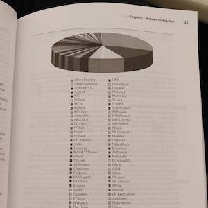
</a>

This final bar chart is fraught with problems. The biggest problem by far
is that there are way too many wedges to keep track of. Just to make sure
there is no possible way to understand what is going on, the chart is
printed without color. The designers of this chart must hate their data.

## Email by the Billions

<a href="https://drive.google.com/open?id=1Q9U_kA-nwt4ZGb9rIv-tDmtaQn_CVDJd" class="image-right">
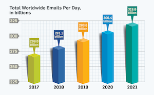
</a>

[Ken][Ken Moreland] showed us this plot that comes from [a recent technical
paper]. The chart clearly puts form over function with the needless 3D
effects and shadows (which are inconsistent).

But the more serious issue is that the plot unfairly represents the data.
The intention of this chart is clearly to demonstrate that email traffic is
steeply on the rise. But does the data agree with that?

If we look closely, we see that the bars do not start at 0. Instead, they
start at a very large 225 _billion_ emails.

<div class="image-stop" />

<a href="https://drive.google.com/open?id=1sUVmzb692XMr0oxw4E5USaOUM4rBrJo5" class="image-right">
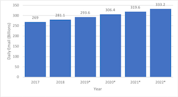
</a>

This plot corrects the scaling. In the previous plot it appears that the
amount of email traffic has doubled, but in truth email traffic is only
going up by a small fraction in this time.

Speaking of time, the time range selected for this plot is a bit weird,
too. The time range of the plot is fairly narrow. The majority of the plot
is a prediction of the future. Why not show the trend with collected data?

<div class="image-stop" />

<a href="https://drive.google.com/open?id=19fP75sTliw-De_knGZFMfH2gNYderzfI" class="image-right">
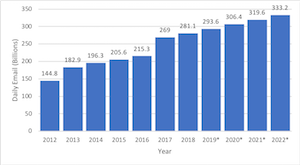
</a>

[Ken][Ken Moreland] figures that the data for this plot comes from the
[Radicati Group]. In about an hour, [Ken][Ken Moreland] was able to pull
data back to 2012. here is the plot of that data.

As you can see, there have been some recent surges in email traffic, but
the look like they may be leveling off. Again, not the story of extreme
email traffic growth purported by the original chart.

## Surprise Results

<a href="https://drive.google.com/open?id=1EqzbdVkHrPcCC6FPYtZnII4n5lcTLpdP" class="image-right">
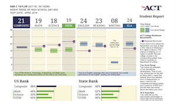
</a>

Earlier this year, [Ken's][Ken Moreland] daughter took the [ACT], an aptitude test commonly used  for admissions by may United States colleges.
When she received her results, which were similar to [the example][ACT example] shown here, she received a shock.
Although most of the scores were as expected, the score for writing (second column from the right) was shockingly low.

Did she fail that part of the test?
Actually, no.
It is a simple matter of odd scaling.
Most of the sections in the ACT as well as the composite scores are graded on a scale from 1 to 36.
But for some reason the writing test scores are scaled from 2 to 12.
Because the scaling range is so much smaller than all other scores, it becomes a scary shock for each and every of the 1.7 million students that take the test every year.

The problem is simple to solve.
Just rescale the writing score to be in the 36 point scale as the others (multiply the score by 3).

## Farewell Georges


It is with a heavy heart this year that we say goodbye to Georges Grinstein.
Georges was one of the founding members of the first VisLies (in 1995!) and had continued to help organize VisLies since.
Unfortunately, Georges passed away this year.

We spend some time this year to remember Georges and celebrate his life.

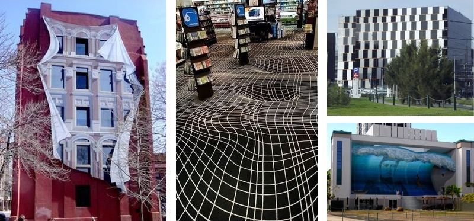

Something that Georges enjoyed doing each year at VisLies was presenting an example of an (intentional) optical illusion in the form of architecture.
Above are some examples of the kinds of things Georges showed.

[Ken][Ken Moreland] choose to honor Georges by showing his own personal favorite illusion in architecture.
This example comes from a set of the biggest lying liars who have been
operating for decades: the Walt Disney park Imagineers.

```
DO THIS DO THIS DO THIS DO THIS
```

## Lake Macquarie Got Bigger

<a href="https://drive.google.com/open?id=1Pel1yaTh8vQeG7ssLW0XMhXAHEZ3qAxt" class="image-left">
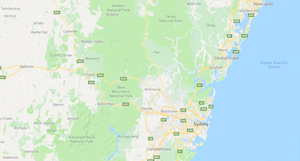
</a>

[Ben Simons] started with a quick geography lesson of Sydney, Australia. Not
that there is any specific lie about Sydney, but as a quick orientation for
us Northern-Hemisphere-ers that might not be familiar with it. The map is
shown here. As you can see, the coast has its fair share of bays and
rivers, but otherwise follows an arc.

<div class="image-stop" />

<a href="https://drive.google.com/open?id=1sKzPBT60mIapFRr_icu4vnIeU-QYOFFp" class="image-right">
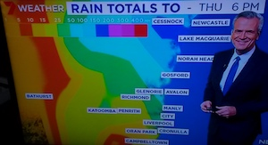
</a>

So, [Ben][Ben Simons] was a bit surprised when he looked up to this TV
weather report and saw a rather startling change in the coastline.
According to this map, lake Macquarie (labeled near the weatherperson's
head) has become _huge_.

After a double take, it starts to become clear that, no, a huge chuck of
Australia has not broken off to sea. Yet. Probably. Rather, the colors used
to represent rainfall unwisely use the same color to represent ocean in
this map.

Rules of probability dictate that the area in this map between the Cessnock
and Lake Macquarie labels has just received between 150 and 200mm of rain
(which is probably not enough to turn the whole area into a lake). But what
about the other patches? What about the other subtle features of the map?
Or are maybe we are supposed to assume that it's just really rainy off the
coast?

## Evil Histograms

[Michael Correll] brought up the positive and negative aspects of
[histogram] visualizations. Histograms are a good way to show the
distribution of data. However, continuous data must be grouped into bins of
defined ranges.

And therein lies a problem. The choice of bins can have a large effect on
what the visualization shows. To demonstrate this, [Michael][Michael
Correll] showed an [adversarial visualization application] that attempts to
make the most evil histograms possible.

<a href="https://drive.google.com/open?id=1Rv9JcCSrPO83W43Sdlx3IEFDBxYD-H9g" class="image-right">
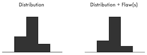
</a>

Here is an example generated by [the application][adversarial visualization
application]. The histogram on the left was generated from a set of 100
data values randomly generated from a Gaussian probability distribution.
The histogram on the right was generated from the same 100 values _plus_ an
additional 20 data items with the same value, which should really skew the
apparent distribution. However the bins being used for this histogram make
the two look nearly identical.

<div class="image-stop" />

<a href="https://drive.google.com/open?id=1veXw6AJJPp2FQmMZFJtWYMoBXqn-whEr" class="image-right">
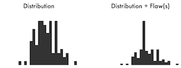
</a>

In contrast, consider these two histograms. The underlying data of these
two histograms is exactly the same as the previous example. But in this
case the different bin choices highlight the dissimilarity between the two
data sets (although you might be hard pressed to realize the exact
relationship between the two sets of data).

In general, fewer bins (with wider ranges) tend to hide details. That
would suggest that having more bins is better, but too many bins (with
narrow ranges) can fail to estimate the density of the samples.
Consequently, when using histogram visualizations it is prudent to
experiment with the number of bins to best understand the data.

## Deceitful Backgrounds

<a href="https://en.wikipedia.org/wiki/Contrast_effect" class="image-right">
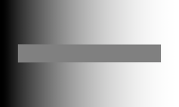
</a>

[David Borland] presented a fun and relevant optical illusion named
[simultaneous contrast] in which the background can have a dramatic effect
on the perceived colors in it. Take, for example, the bar shown here. The
bar is clearly lighter on its left end and darker on its right end, right?
Well, no. The bar is actually a uniform color, but it appears to change
color because of the changing background. Don't believe it? Cover the top
and bottom of the bar with your hands and you can see the uniform color.
Now remove your hands. Even knowing the bar is all one color, it is still
hard to "see" it as one color.

<a href="https://en.wikipedia.org/wiki/Contrast_effect" class="image-left">
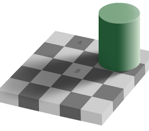
</a>

The effects of simultaneous contrast can be _very_ dramatic. Take for
example this image and look particularly at the tiles marked `A` and `B`.
`A` is clearly darker than `B`, right? Well, actually, the pixel color
value of both is the same. (It's hex color #8B8B8B or 47% grayscale. Don't
believe us? Check the colors with your favorite image editor. Go ahead.
We'll wait.) But regardless of how much you tell yourself that the two
colors are the same, you just can't "see" them the same.

Beware, because simultaneous contrast can come into play in visualization.
Human viewers might not see colors with the same brightness that they are
actually displayed. This helps explain why studies show subjects [error up
to 20%] when using grayscale-only representations for values.


[Ken Moreland]: http://kennethmoreland.com
[Ben Simons]: mailto:bsimons@acm.org
[Michael Correll]: http://correll.io/
[David Borland]: https://renci.org/staff/david-borland/

[histogram]: https://en.wikipedia.org/wiki/Histogram
[adversarial visualization application]: https://algebraicvis.github.io/SanityCheck/attack/
[a recent technical paper]: http://dx.doi.org/10.1145/3213776
[Radicati Group]: https://www.radicati.com/
[ACT]: http://www.act.org/
[ACT example]: http://www.act.org/content/act/en/products-and-services/the-act/scores/understanding-your-scores.html
[simultaneous contrast]: https://en.wikipedia.org/wiki/Contrast_effect
[error up to 20%]: https://doi.org/10.1109/38.7760
